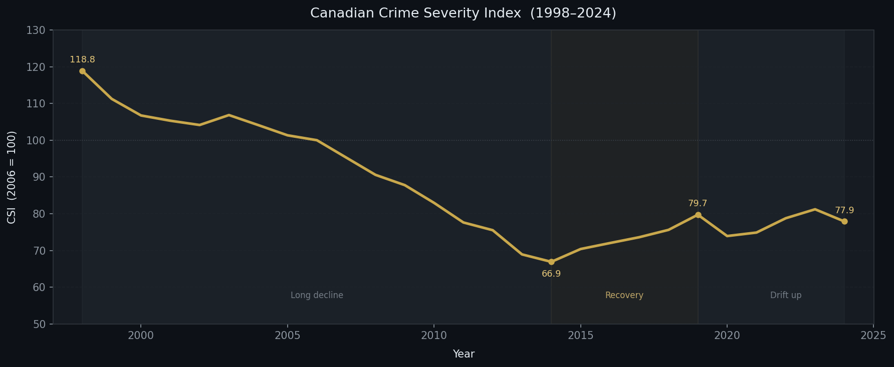
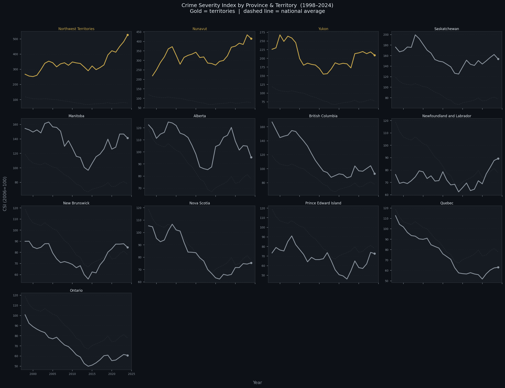
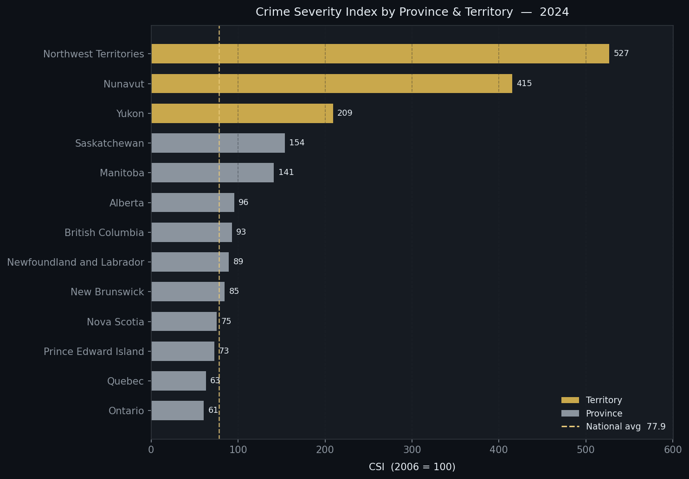
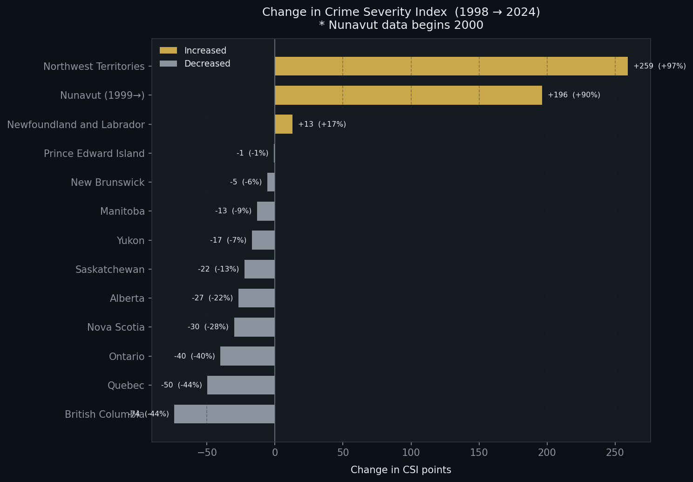
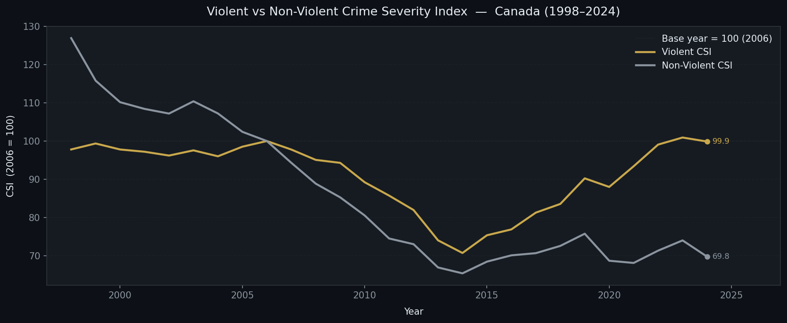

# Crime Severity Canada

Analysis of the **Statistics Canada Crime Severity Index (CSI)** from 1998 to 2024,
covering all provinces, territories, and major census metropolitan areas (CMAs).

---

## Key Findings

### National

- Canada's CSI **fell 34.5%** from 118.8 in 1998 to 77.9 in 2024, with a historic low
  of 66.9 in **2014**.
- Since 2014 the index has been **drifting upward** — a trend that warrants monitoring.
  The 2024 reading of 77.9 is the highest since 2015.
- **Violent crime** has declined more slowly than non-violent crime and is rising again
  post-2014, suggesting the recovery is uneven.

---

### By Province & Territory

| Geography | 2024 CSI | Direction since 1998 | Standout finding |
|-----------|----------|----------------------|-----------------|
| **Northwest Territories** | **527** | ▲ +97 % | Highest in Canada by a wide margin; CSI nearly doubled since 1998 — a persistent and worsening crisis |
| **Nunavut** | **415** | ▲ elevated | Second highest; near its all-time peak, reflecting deep structural challenges |
| **Yukon** | **209** | ▼ declining | Remains very high but has pulled back from its peak of ~268 |
| **Saskatchewan** | **154** | ▲ rising | Highest among the 10 provinces — nearly **double** the national average; has been trending upward since the early 2000s |
| **Manitoba** | **141** | → flat | Persistently elevated; as expected|
| **Alberta** | **96** | ▼ declining | Slightly above national average but meaningful long-run improvement |
| **British Columbia** | **93** | ▼▼ major decline | Largest absolute fall among provinces, dropping from ~167 to 93 (−44 %) |
| **Newfoundland & Labrador** | **89** | ▲ rising recently | Near its all-time high; recent worsening after years of improvement |
| **New Brunswick** | **85** | ▼ gradual | Slightly above national average; slow but steady improvement |
| **Nova Scotia** | **75** | ▼ improving | Below national average; solid long-run decline |
| **Prince Edward Island** | **73** | ▼ improving | Consistently one of the safer provinces |
| **Quebec** | **63** | ▼▼ major decline | Fell nearly 44 % from its peak; among the strongest performers nationally |
| **Ontario** | **61** | ▼▼ major decline | **Lowest CSI among all provinces** — 22 % below the national average |

> CSI is indexed to 2006 = 100. Values above 100 indicate more/more-serious crime than 2006.

---

## Visualisations

### 1 — National Trend (1998–2024)


---

### 2 — Provincial & Territorial Trends


Gold lines = territories (NWT, Nunavut, Yukon). Dashed = national average.

---

### 3 — 2024 Rankings


---

### 4 — Change from 1998 to 2024


Gold = increased since baseline. Grey = decreased. Nunavut data begins 2000.

---

### 5 — Violent vs Non-Violent CSI (National)


---

## Data Source

| Field | Detail |
|-------|--------|
| Publisher | Statistics Canada |
| Table | Police-reported crime statistics, Crime Severity Index |
| Coverage | 1998–2024 |
| Raw shape | 22,908 rows × 15 columns |
| File | `Raw Data/Severe Data.csv` |

---

## Folder Structure

```
Crime Severity Canada/
├── README.md
├── Raw Data/
│   └── Severe Data.csv               ← original Statistics Canada export (unmodified)
├── Clean Data/
│   └── crime_severity_cleaned.csv    ← cleaned, 7-column dataset
├── Analysis/
│   ├── 02_Analysis.ipynb             ← seaborn trend plots
│   └── plots/                        ← exported PNGs (generated by notebook)
└── Notebooks/
    └── 01_Data_Cleaning.ipynb        ← full cleaning pipeline
```

---

## Cleaning Steps

| Step | Issue | Fix |
|------|-------|-----|
| 1 | `VALUE` stores missing entries as empty strings | Replace with `NaN` |
| 2 | `VALUE` stored as `object` dtype | Cast to `float64` |
| 3 | `REF_DATE` stored as string year | Cast to `int64` |
| 4 | `GEO` has trailing codes e.g. `"Alberta [48]"` | Strip `[xx]` with regex |
| 5 | Nearly-empty columns: `STATUS`, `SYMBOL`, `TERMINATED` | Drop |
| 6 | Redundant metadata: `SCALAR_FACTOR`, `SCALAR_ID`, `UOM_ID`, `DGUID`, `COORDINATE` | Drop |
| 7 | Column names verbose / inconsistent | Rename to snake_case |

**Result**: 22,908 rows × 7 columns (`year`, `geography`, `metric`, `unit`, `vector`, `value`, `decimals`).

---

## How to Run

1. **Clean the data** — open `Notebooks/01_Data_Cleaning.ipynb`, Restart & Run All.
   Saves `Clean Data/crime_severity_cleaned.csv`.
2. **Run the analysis** — open `Analysis/02_Analysis.ipynb`, Restart & Run All.
   Saves five PNGs to `Analysis/plots/`.

Requires Python with `pandas`, `numpy`, `matplotlib`, `seaborn`.


